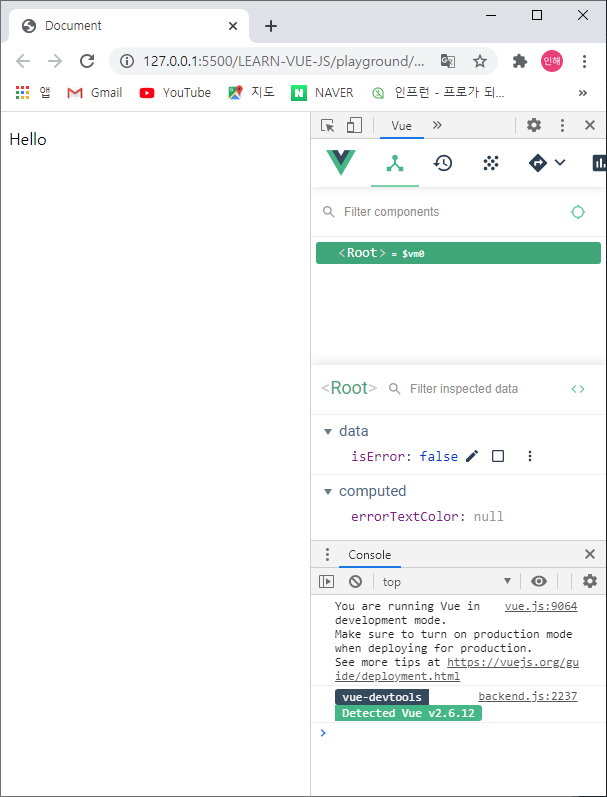
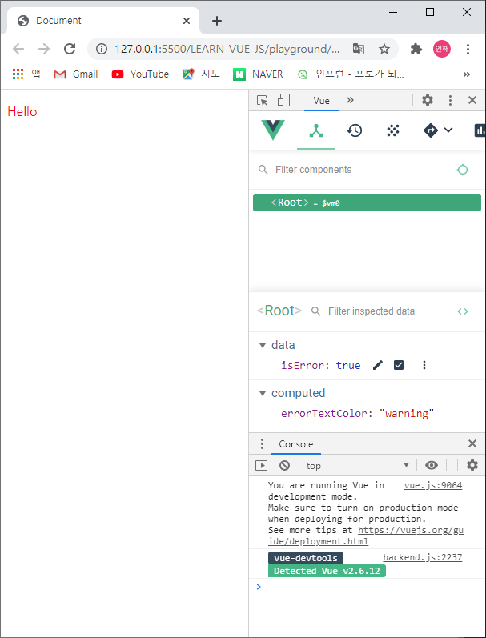

# 템플릿 문법 - 실전

<br>

## watch 속성

**지정한 대상의 값이 변경될 때마다 정의한 함수가 실행**된다.

데이터 변경에 대한 응답으로 비동기식 또는 시간이 많이 소요되는 조작을 수행하려는 경우에 가장 유용하다.

<br>

```vue
<div id="app">
    <p>{{ num }}</p>
    <button v-on:click="addNum">increase</button>
</div>

<script src="https://cdn.jsdelivr.net/npm/vue/dist/vue.js"></script>
  <script>
    new Vue ({
      el: '#app',
      data: {
        num: 10
      },
      watch: {
        num: function() {
          this.logText();
        }
      },
      methods: {
        addNum: function() {
          this.num = this.num + 1;
        },
        logText: function() {
          console.log('changed');
        }
     }
  })
</script>
```

<br>

+ increase 버튼을 눌러 addNum 이 실행되어 num이 올라갈 경우, 콘솔에 changed가 찍히도록 함

<br><br>

-----

<br>

## computed 속성

**지정한 대상의 값이 변경됨에 반응하여 특정값을 반환**해준다.

<br>

### watch vs computed

1. watch
   + 지정된 대상의 값이 변경될 때마다 **'함수실행'**
   + 무거운 동작들 / 특히 데이터 요청에 적합

2. computed
   + 지정된 대상의 값이 변경될 때마다 **'계산 후 특정값 반환'**
   + 대부분의 case에 computed가 더 적합함
   + 기본적인 valuation, 간단한 text 연산 쪽에 적합

<br><br>

```vue
<div id="app">
    {{ num }}
</div>

<script src="https://cdn.jsdelivr.net/npm/vue/dist/vue.js"></script>
<script>
    new Vue({
        el: '#app',
        data: {
            num: 10
        },
        computed: {
            doubleNum: function() {
                return this.num * 2;
            }
        },
        watch: {
            num: function(newValue, oldValue) {
                this.fetchUserByNumber(newValue);
            }
        },
        methods: {
            fetchUserByNumber: function(num) {
                // console.log(num);
                axios.get(num);
            }
        }
	});
</script>
```

<br>

**_num: function(newValue, oldValue)_**

+ watch는 값의 변화를 계속적으로 갱신하고 있기 때문에, 이전 값과 갱신된 값을 두개 다 인자로 받을 수 있다.

+ newValue, oldValue : 갱신된 값 / 이전 값

<br><br>

-----

<br>

```vue
<style>
    .warning {
        color: red;
    }
</style>
```

+ `<head>` 내부에 있는 `style` 태그
+ warning : text color가 red로 변하는 속성


```vue
<div id="app">
    <p v-bind:class="errorTextColor">Hello</p>
<!--v-bind:class="{warning : isError}"로 표현할 수도 있었음-->
    </div>

<script src="https://cdn.jsdelivr.net/npm/vue/dist/vue.js"></script>
<script>
    new Vue({
    el: '#app',
    data: {
        // cname: 'blue-text',
        isError: false
    },
    computed: {
        errorTextColor: function() {
            //삼항연산자 풀어쓰기
            // if (isError) {
            //   return 'warning'
            // } else {
            //   return null;
            // }
            return this.isError ? 'warning' : null;
        }
    }
});
```

<br>



<br>

+ computed를 사용하지 않으면, **_v-bind:class="errorTextColor_** 를 **_v-bind:class="{warning : isError}_** 로 표현할 수도 있음
+ isError라는 진위값에 따라서 class값을 넣거나 넣지않을 수 있음

+ **_return_** **this*.*isError ? 'warning' : null;**
  + 삼항연산자 - isError가 true면 warning / false면 null
  + Hello가 각각 red / black (true / false)

