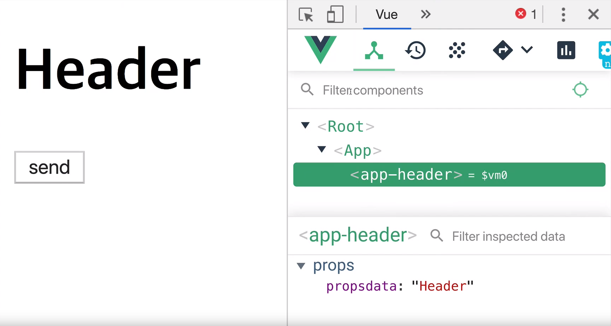

# 싱글 파일 컴포넌트

App.vue 새로 만들기

vue + enter키 : 기본 

<br>▶ **_\<template> : HTML_**

템플릿 안에 최상위 레벨, 즉 **루트에 하나의 element**만 있어야한다.

`<div></div>` `<div></div>` ... 두개 이상의 병렬 연결 안됨

`<div>그 안에 다양한 element는 허용</div>` 

<br>

▶ **_\<script> : java script_**

.vue 파일에서는 컴포넌트를 재사용할 확률이 매우 높아서 여러 컴포넌트에서 동일한 값을 공유/참조하면 안 됨

+ 이 전까지는 data에 객체만 연결해도 되었지만, .vue 파일에서는 불가능

+ **함수로 반환값을 받는** 형태로만 가능

<br>

## 컴포넌트 등록

1. 컴포넌트 이름은 최소한 두 단어 이상으로 조합할 것
   + 한 단어로 만들었을 경우, App.vue 파일의 `<template>`에 기입할 때, vue에서 제공하는 표준 태그인지 component인지 구분하기 어려움
     + ex) main.vue
   
2. components에 만든 파일을 App.vue에서 사용할 경우

   + `<script>` 안에  import 해줄 것

     + ```javascript
       import AppHeader from './components/AppHeader.vue';
       ```

     + ```javascript
       var AppHeader = {
           template: '<header><h1>Header</h1></header>'
       }
       ```

       + 전에는 이처럼 파일 내부에서 선언해줬었지만, 이제는 import로 주소를 가져올 수 있음

   + `<script>` 안에 components로 정의 해줄 것()

     + ```javascript
       export default {
         components: {
           'app-header': AppHeader
         }
       }
       ```

<br><br>

## props  속성 사용

<br>

```vue
<template>
  <div>
    <!--<app-header v-bind:프롭스 속성 이름="상위 컴포넌트의 데이터 이름"></app-header>-->
    <app-header v-bind:propsdata="str"></app-header>
  </div>
</template>
```

<br>

1.  <app-header *v-bind*:*propsdata*="str">\</app-header>

  = \<h1>{{ propsdata }}\</h1>

<br>

```javascript
export default {
 	props: ['propsdata']
</template>
```

2. `<script>` 안에 components로 정의 해줄 것(propsdata)

<br><br>

## event emit 구현

<br>

```vue
<template>
  <header>
    <h1>{{ propsdata }}</h1>
    <button v-on:click="sendEvent">send</button>
  </header>
</template>

<script>
export default {
  props: 'propsdata',
  methods: {
    sendEvent: function() {	//이벤트 보내기
      this.$emit('renew');
    }
  }
}
</script>
```

<br>

클릭하면 propsdata에서 renew로 글자가 바뀌는 버튼 구현

sendEvent 함수 method 구현

<br>

```vue
<template>
  <div>
    <!--<app-header v-bind:프롭스 속성 이름="상위 컴포넌트의 데이터 이름"></app-header>-->
    <app-header 
      v-bind:propsdata="str"
      v-on:renew="renewStr">  <!--AppHeader에서 보낸 이벤트를 받는 곳-->
    </app-header>
    <h1>{{ propsdata }}</h1>
  </div>
</template>

<script>
import AppHeader from './components/AppHeader.vue';

export default {
  props: ['propsdata'],
  data: function() { //함수로 반환값을 주는 형태 가능
    return{
      str: 'Header'
    }
  },
  components: {
    'app-header': AppHeader
  },
  methods: {
    renewStr: function() {
      this.str = 'hi';
    }
  }
}
</script>
```

<br>
AppHeader 컴포넌트에서 이벤트를 올렸을 때, App.vue의 AppHeader 컴포넌트를 등록한 태그에서 받을 수 있음

str이 'Header'에서 'hi'로 바뀔 수 있도록 하는 renewStr 함수 method 구현

<br>

