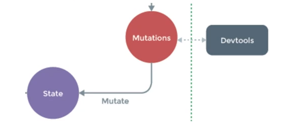
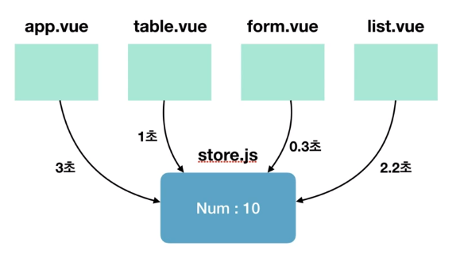

# Vuex - 주요 기술 요소

<br>

### Vuex 설치하기

+ Vuex는 싱글 파일 컴포넌트 체곅에서 NPM 방식으로 라이브러리를 설치하는 게 좋다.

  ``npm install vuex --save`

※ Vuex는 ES6와 함께 사용해야 더 많은 기능과 이점을 제공받을 수 있음

<br>

```javascript
// store.js
import Vue from 'vue'
import Vuex from 'vuex'

Vue.use(Vuex);

export const store = new Vuex.Store({
    //
})
```

```javascript
// 다른파일(main.js)에서 store변수 사용하기
import Vue from 'vue'
import App from './App.vue'
import { store } from './store/store'

new Vue({
    el: "#app",
    store,	// 원래는 store: store
	// ...
})
```

<br>

* use
  * 일반적으로 Vue를 사용할 때, 전역으로 특정 기능을 추가하고 싶을 때 / 즉 global functionality를 추가하고 싶을 때

+ export
  + store 변수를 다른 파일에서도 사용가능하도록 함
  + 다른 파일에서는 import { store } from './store/store' 로 받음
  + 이때, store: store은 앞뒤가 같은 이름을 사용하므로 그냥 store 로 줄일 수 있음

<br>

<br>

-----

<br>

## Vuex 기술요소

+ state : 여러 컴포넌트에 공유되는 데이터 `data`
+ getters : 연산된 state 값을 접근하는 속성 `computed`
+ mutations : state 값을 변경하는 이벤트 로직 / 메서드 `methods`
+ actions : 비동기 처리 로직을 선언하는 메서드 `aysc methods`

<br><br>

----

<br>

## state란?

여러 컴포넌트 간에 공유할 데이터 - **상태**

<br>

```javascript
// Vue
data: {
	message: 'Hello Vue.js!'
}

// Vuex
state : {
    message: 'Hello Vue.js!'
}
```

```html
<!--Vue-->
<p>{{ message }}</p>

<!--Vuex-->
<p>{{ this.$store.state.message }}</p>
```

<br>

+ state를 선언하고 template에서 접근하는 방법은 `this.$store.state.(변수)` 
+ Vue.use(Vuex) 라는 global functionality를 추가해줬기 때문에 접근이 가능 한 것

+ Vue에서의 data와 다른 점 : 속성명 / 여러컴포넌트들에서 접근가능하다는 점

<br><br>

-----

<br>

## getters란?

state 값을 접근하는 속성이자 `computed()`처럼 미리 연산된 값을 접근하는 속성

<br>

```javascript
// store.js
state: {
    num: 10
},
getters: {
    getNumber(state) {
        return state.num;
    },
    doubleNumber(state) {
        return state.num * 2;
    }
}
```

```html
<p>{{ this.$store.getters.getNumber }}</p>
<p>{{ this.$store.getters.doubleNumber }}</p>
```

<br>

+ `this.$store.state.message` 와 비슷해보이지만, 이후에 나오는 헬퍼함수를 이용하면 `this.$store.getters.getNumber`를 `this.getNumber`로 축약할 수 있다.
+ computed가 주는 이점을 같이 활용할 수 있음

<br><br>

## mutations란?

state의 값을 변경할 수 있는 **유일한 방법**이자 메서드

뮤테이션은 `commit()` 명령어로 동작시킨다.

<br>

```javascript
//store.js
state: { num: 10 },
mutations: {
    printNumbers(state) {	//속성 첫번째 인자로 state를 가져옴
        return state.num
    },
    sumNumbers(state, anotherNum) {
        return state.num + anotherNum;
    }
}

//App.vue
this.$store.commit('printNumbers');
this.$store.commit('sumNumbers', 20);
```

<br>

+ mutation은 속성  첫 번째 인자로 무조건 state를 사용함
+ `this.$store.commit('메서드명(mutations명)')`

<br>

state를 변경하기 위해 mutations를 동작시킬 때 인자(payload)를 전달할 수 있음

```javascript
//store.js
state: { num: 10 },
mutations: {
    modifyState(state, payload) {
        console.log(payload.str)
        return state.storeNum += payload.num;
    }
}

//App.vue
this.$store.commit('modifyState', {
    str: 'passed from payload',
    num: 20
})
```

<br><br>

#### state는 왜 직접 변경하지 않고 mutations로 변경할까?

+ 여러개의 컴포넌트에서 아래와 같이 state 값을 변경하는 경우 **어느 컴포넌트에서 해당 state를 변경했는지 추적하기가 어렵다.**

```javascript
methods: {
	increaseCounter() { this.$store.state.counter++; }
}
```

<br>

+ 특정 시점에 어떤 컴포넌트가 state를 접근하여 변경한 건지 확인하기 어렵기 때문
+ 따라서, 뷰의 반응성을 거스르지 않게 명시적으로 상태 변화를 수행. 반응성, 디버깅, 테스팅 혜택



<br><br>

-----

<br>

## actions란?

비동기 처리 로직을 선언하는 메서드. 비동기 로직을 담당하는 mutations

데이터 요청, Promise, ES6 async과 같은 비동기 처리는 모두 actions에 선언

```javascript
// store.js
state: {
    num: 10
},
mutations: {
    doubleNumber(state) {
        state.num * 2;
    }
},
actions: {
    delayDoubleNumber(context) {
        //context로 store의 메서드와 속성에 접근
        context.commit('doubleNumber');
    }
}

// App.vue
this.$store.dispatch('delayDoubleNumber');
```

<br>

+ mutation에게 신호를 보내는 역할 

<br>

actions 비동기 코드 예제)

```javascript
// store.js
mutations: {
    addCounter(state) {
        state.counter++
    },
},
actions: {
    delayedAddCounter(context) {
        setTimeout(() => context.commit('addCounter'), 2000);	// 2000ms라서 2초
    }
}

// App.vue
methods: {
    incrementCounter() {
        this.$store.dispatch('delayedAddCounter');
    }
}
```

<br>

+ incrementCounter 누르면 delayedAddCounter가 실행되어 delayedAddCounter가 실행되어 2초 정도 기다렸다가 addCounter가 실행되어 count가 하나 증가

<br>

```javascript
// store.js
mutations: {
    setData(state, fetchData) {
        state.product = fetchedData;
    }
},
actions: {
    fetchProductData(context) {
        return axios.get('https://domain.com/products/1').then(response => context.commit('setData', response));
    }
}

// App.vue
methods: {
    getProduct() {
        this.$store.dispatch('fetchProductData');
    }
}
```

<br>

+ actions에서는 axios라는 http 라이브러리로 `get`요청을 서버(주소)에 보내서 `then` 이라는 promise callback으로 응답값을 mutations으로 넘겨줌

<br><br>

-----

<br>

#### 왜 비동기 처리 로직은 actions에 선언해야 할까?

+ 언제든 어느 컴포넌트에서 해당 state를 호출하고 변경했는지 확인하기 어려움



[그림] 여러개의 컴포넌트에서 mutations로 시간차를 두고 state를 변경하는 경우

> 결론 : state 값의 변화를 추적하기 어렵기 때문에 mutations 속성ㅇ는 동기 처리 로직만 넣어야한다.