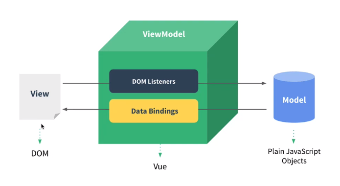

# Vue.js 소개

+ MUUM 패턴의 뷰모델(ViewModel) 레이어에 해당하는 화면(View)단 라이브러리

 

 

View - 브라우저에서 사용자들에게 비춰지는 화면

화면들의 요소인 HTML을 DOM을 이용해서 자바스크립트로 조작할 수 있도록 구성

왼쪽 화면에서 특정사용자가 키보드 입력/마우스 클릭 등의 이벤트들을 중간에 DOM Listeners로 청취하게 됨

Vue에서 이것을 JavaScript의 데이터를 바꾸어주거나, 특정 로직에서 실행하게 해줌 

javaScript 데이터가 변했을 때, 바로 Data Bindings를 이용하여 화면에 반영하게 됨

  

+ web-dev.html

+ vue-way.html

+ index.html

 

+ auto close tag 다운 받으면, 기본 틀 만들기 쉬움

  + ! 누르고 탭 키 누르면 기본틀 자동생성
  + div 태그 타이핑 후 css선택자인 #을 누르고 다음 작성하면 태그 자동완성
    + **_div#app = \
\
_**
  + **_\<stript>_** 태그안에 div 태그 정보를 가져온 후, str 변수에 값 할당하여 이를 div에 넣어주기
  + 변수 값이 바뀌면 다시 한 번 써줘야함

 

+ 개발자도구에서 Vue 선택
  + Vue에서 관리하는 data란이 있음
  + 리액티비티 : data를 변화하면 화면이 바로바로 변화하면 그려지는 것 
