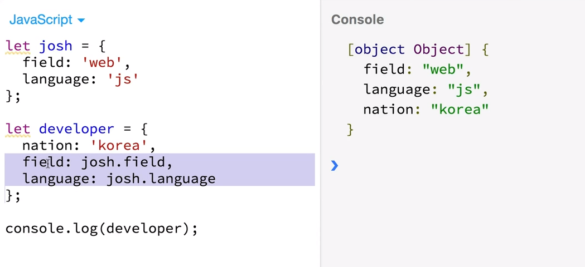

# Vuex - 헬퍼 함수

<br>

### 각 속성들을 더 쉽게 사용하는 방법 - Helper

Store에 있는 아래 4가지 속성들을 간편하게 코딩하는 방법

+ state -> mapState
+ getters -> mapGetters
+ mutations -> mapMutations
+ actions -> mapActions

<br>

## 헬퍼의 사용법

<br>헬퍼를 사용하고자 하는 vue 파일에서 아래와 같이 해당 헬퍼를 로딩

```javascript
// App.vue
import { mapState } from 'vuex'
import { mapGetter } from 'vuex'
import { mapMutations } from 'vuex'
import { mapActions } from 'vuex'	// 네개를 쉼표로 묶어 한줄로 선언할 수 있음

export default {	//component logic단 / script단
    computed() { ...mapState(['num']), ...mapGetter(['countedNum']) },
    methods: { ...mapMutations(['clickBtn']), ...mapActions(['asyncClickBtn']) }
}
```

이때, `...`은 ES6의 **Object Spread Operator**이다.

num, countedNum은 store.js에 state로 정의된 것으로, 가져와서 mapping한 것

컴포넌트에서 this.num을 했을 때, store에 있는 state num을 들고온 것과 동일한 효과 / this.countedNum을 했을 때는 store에 있는 getters countedNum을 들고온 것과 동일한 효과

템플릿에서 click 버튼을 누르면 store에 있는 메소드 발동이 되어 mutations click이 호출됨 / asyncClick 버튼을 누르면 store에 있는 actions이 호출됨

<br>

#### > ES6 Object Spread Operator `...`



+ price, items 등의 컴포넌트 고유의 computed 속성을 쓰고, mapGetters를 함께 사용하고 싶다면 무조건 Spread Operator로 연결해줘야함

<br>

-----

<br>

##  mapState

+ Vuex에 선언한 state 속성을 뷰 컴포넌트에 더 쉽게 연결해주는 헬퍼

```javascript
// App.vue
import { mapState } from 'vuex'

computed() {	// 계산 속성
    ...mapState(['num'])	//배열리터럴에 문자열로 연결
    // num() { return this.$store.state.num; } 원래 이렇게 접근해야했는데 윗줄처럼 줄일 수 있음
}

// store.js
state: {
    num: 10
}
```

```html
<!--<p>{{ this.$store.state.num }}</p>-->
<p>{{ this.num }}</p>
```

<br>

## mapGetters

+ Vuex에 선언한 getters 속성을 뷰 컴포넌트에 더 쉽게 연결해주는 헬퍼

```javascript
// App.vue
import { mapGetters } from 'vuex'

computed() { ...mapState(['reverseMessage']) }
}

// store.js
getters: {
	reverseMessage(state) {
        // 메세지를 받았을 때 역순으로 바꾸어줌, 각각 쪼개서 역순으로 한 뒤 다시 합치는 방법
        return state.msg.split('').reverse().join('');
    }
}
```

```html
<!--<p>{{ this.$store.getters.reverseMessage }}</p>-->
<p>{{ this.reverseMessage }}</p>
```

<br>

## mapMutations

+ Vuex에 선언한 mutations 속성을 뷰 컴포넌트에 더 쉽게 연결해주는 헬퍼

```javascript
// App.vue
import { mapMutations } from 'vuex'

methods: { 
    ...mapMutations(['clickBtn']),
    authLogin() {},
    displayTable() {}
}

// store.js
mutations: {
	clickBtn(state) {
        alert(state.msg);
    }
}
```

```html
<button @click="clickBtn">
    popup message
</button>
```

<br>

popup message를 누르면 클릭버튼에서 mapmutations에 clickBtn을 오게 되고, mutations logic에 클릭버튼을 띄워줌

<br>

## mapActions

+ Vuex에 선언한 actions 속성을 뷰 컴포넌트에 더 쉽게 연결해주는 헬퍼

```javascript
// App.vue
import { mapActions } from 'vuex'

methods: { 
    ...mapActions(['delayClickBtn']),
}

// store.js
actions: {
	delayClickBtn(context) {
        setTimeout(() => context.commit('clickBtn'), 2000);
    }
}
```

```html
<button @click="delayClickBtn">
    delay popup message
</button>
```

<br>

<br>

-----

<br>

## 헬퍼의 유연한 문법

+ Vuex에 선언한 속성을 그대로 컴포넌트에 연결하는 문법

```javascript
// 배열 리터럴
...mapMutations([
    'clickBtn',	// 'clickBtn': clickBtn
    'addNumber'	// addNumber(인자) -> 선언을 안해도 자연스럽게 인자를 넘겨줌
])
```

+ Vuex에 선언한 속성을 컴포넌트의 특정 메서드에다가 연결하는 문법

```javascript
// 객체 리터럴
...mapMutations([
    popupMsg: 'clickBtn'	// 컴포넌트 메서드 명 : Store의 뮤테이션 명
])
```

