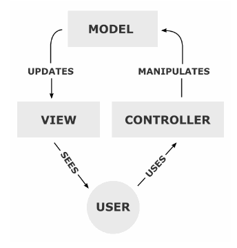
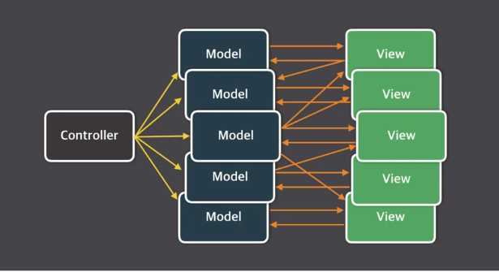
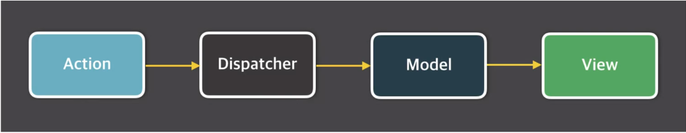
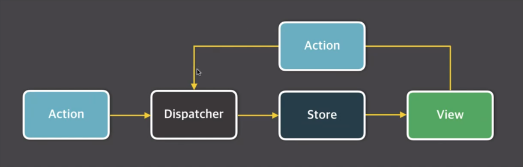

# Vuex - 상태관리 라이브러리

 

## Vuex란?

+ 무수히 많은 컴포넌트의 데이터를 관리하기 위한 상태 관리 패턴이자 라이브러리
+ **React**의 **Flux** 패턴에서 기인함
+ **Vue.js** 중고급 개발자로 성장하기 위한 필수 관문

 

## Flux란?

+ MVC 패턴의 복잡한 데이터 흐름 문제를 해결하는 개발 패턴 - *Unidirectional data flow*

  + MVC 패턴이란?

     

    + 디자인 패턴 중 하나

      + 디자인 패턴이란?
        1. 프로그램이나 어떤 특정한 것을 개발하는 중에 발생했던 문제점들을 정리해서 상황에 따라 간편하게 적용해서 쓸 수 있는 것을 정리하여 특정한 "규약"을 통해 쉽게 쓸 수 있는 형태로 만든 것
        2. 객체 지향 프로그래밍 설계를 할 때 자주 발생하는 문제를 피하기 위해서 사용되는 패턴
        3. 여러 사람이 협업해서 개발할 때 코드를 수정하거나 새로운 기능을 추가해야하는데, 이 때 발생하는 문제를 해결하고자 함

    + Model, View, Controller의 약자

      1. Model
         + 어플리케이션이 **"무엇"** 을 할 것인지 정의
         + 처리되는 알고리즘, DB와 상호작용, 데이터 등등 ...
      2. View
         + 화면에 **"무엇"** 인가를 **"보여주기 위한 역할"** 
         + 컨트롤러 하위에 종속되어 모델이나 컨트롤러가 보여주려고 하는 모든 필요한 것들을 보여줄 것
         + 최종 사용자에게 **"무엇"** 을 화면(UI)으로 보여줌
      3. Controller
         + 모델이 **"어떻게"** 처리할지를 알려주는 역할
         + 모바일에서는 **"화면의 로직처리"** 부분 
         + 화면에서 사용자의 요청을 받아서 처리되는 부분을 구현하게 되며, 요청 내용을 분석해서 Model과 View에 업데이트 요청함

    + 페이스북에서 사용하는 패턴

      + 채팅창, 메뉴 상태관리바 등 메인화면의 여러 뷰가 있는데, 이때 하나의 뷰가 바꼈을 때 다른 뷰에서 추적하기 매우 어려움 (매우 거대해서 복잡하기 때문)

    + 단점

      1. 뷰와 모델이 서로 *의존성을 띄게 됨*
         +  Controller에 다수의 Model과 View가 복잡하게 연결되어 있는 상황이 생길 수 있기 때문
         + Model과 View가 **양방향**
      2. 너무 *복잡하고 비대*해져서, 기능 추가 및 변경에 따라 생기는 문제점을 예측하고 테스트 하기가 어려움
      3. 앱이 복잡해지면서 생기는 업데이트 루프

      

       

+ 모든 데이터가 한방향으로 움직임 / View가 Action호출 가능

 

1. action : 화면에서 발생하는 이벤트 또는 사용자의 입력
2. dispatcher : 데이터를 변경하는 방법, 메서드
3. model : 화면에 표시할 데이터
4. view : 사용자에게 비춰지는 화면

 

+ Flux 패턴의 단방향 데이터 흐름

  + 데이터의 흐름이 여러 갈래로 나뉘지 않고 단방향으로만 처리

  