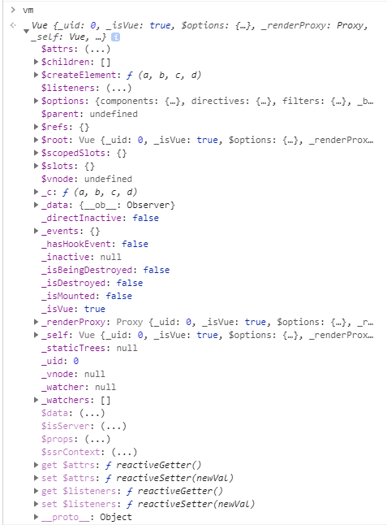
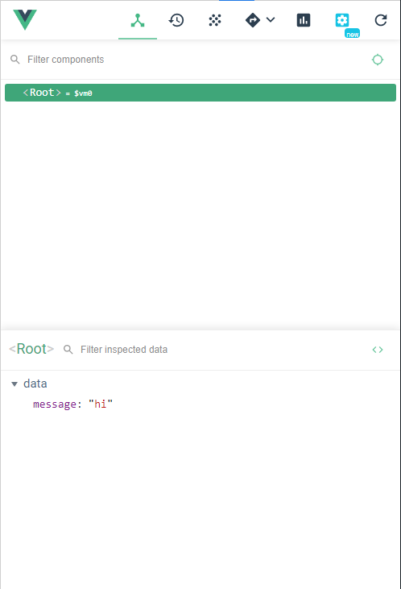
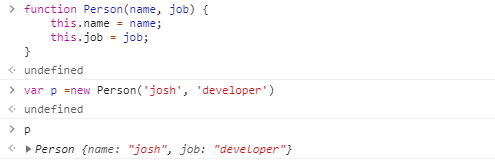
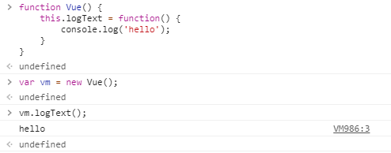

# 인스턴스

### 인스턴스

뷰로 개발할 때 필수로 생성해야 하는 코드

+ 인스턴스 생성 

  + new Vue();

```javascript
var vm = new Vue(); // 변수에 인스턴스 내용 담기
console.log(vm);
```

<br><br>




+ 콘솔에서 vm 입력하면 나오는 창
+ 뷰에서 제공하는 API와 속성

<br>

<br>

-----

<br>

```javascript
<div id="app">
    <!-- ,,,,, --> 
</div>

var vm = new Vue({
    el: '#app', // element의 약자 el, body 태그 안에서 app이라는 이름을 가진 태그를 찾아서 인스턴스를 붙이겠다는 의미
    data: {
        message: 'hi'
    }
        });
```

<br>



<br>

el를 app으로 지정해 선언함에 따라서 위의 div 태그에서 Vue의 기능과 속성들이 유효해짐

el이 없다면, 아무리 script에 데이터를 정의 한다해도 사용할 수 없음

<br><br>

### 생성자함수

1. 함수 이름의 첫 글자는 대문자로 시작합니다.
2. 반드시 `"new"` 연산자를 붙여 실행합니다.

+ 자바스크립트에서 함수를 이용하여 인스턴스를 생성하는 방법

<br>



<br>

+ 콘솔에서 생성자함수 선언
+ 일반함수와 기술적인 차이는 없음

<br><br>



+ 이렇게 Vue가 함수로 저장되어 있으면, 나중에 사용할 수 있음
+ Vue를 사용하는 이유

<br><br>

### 생성자함수로 재사용할 수 있는 옵션과 속성들

```javascript
new Vue({
	el: ,
	template: ,
	data: ,
	methods: ,
    created: ,
    watch: ,
});
```

