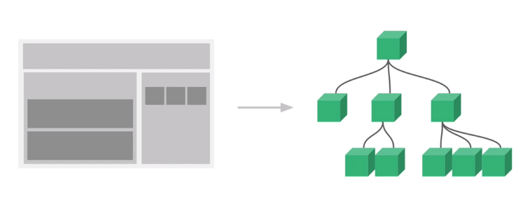

# 컴포넌트

컴포넌트는 화면의 영역을 구분하여 개발할 수 있는 뷰의 기능입니다.

컴포넌트 기반으로 화면을 개발하게 되면 코드의 "재사용성"이 올라가고 빠르게 화면을 제작할 수 있습니다.




### 전역컴포넌트

*Vue**.**component*('컴포넌트 이름', 컴포넌트 내용);

```javascript
<script>
        Vue.component('app-header', {
            template: '<h1>Header</h1>'
        });
        Vue.component('app-content', {
            template: '<div>content</div>'
        });

        new Vue({
            el: '#app',
        })
</script>
```

+ 결과


+ 어디서든지 불러내어 사용할 수 있다는 장점

-----


### 지역컴포넌트

components: {

​        '컴포넌트 이름': 컴포넌트 내용,

 }


```javascript
new Vue({
	el: '#app',
	components: { //보통 여러개의 컴포넌트가 등록됨
		//'컴포넌트 이름': 컴포넌트 내용
		'app-footer': {
			template: '<footer>footer</footer>'
		}
	}
})
```

+ 결과


+ 컴포넌트 기반형식, 즉 싱글파일 컴포넌트 형식으로 개발 시, 특정 컴포넌트 하단에 어떤 컴포넌트가 등록 되는 지를 컴포넌트 속성으로 바로 알 수 있다는 장점
+ 서비스를 등록 시, 아래에 계속 등록해나가는 형식을 이용

-----


