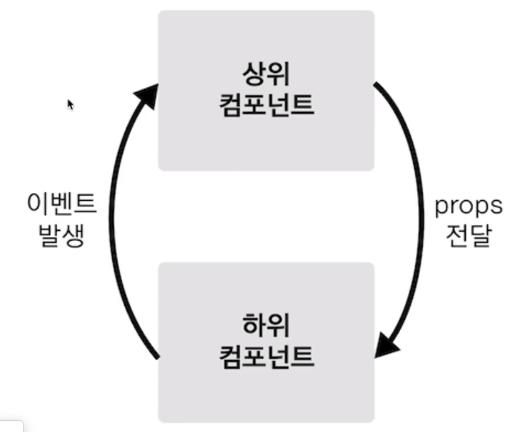
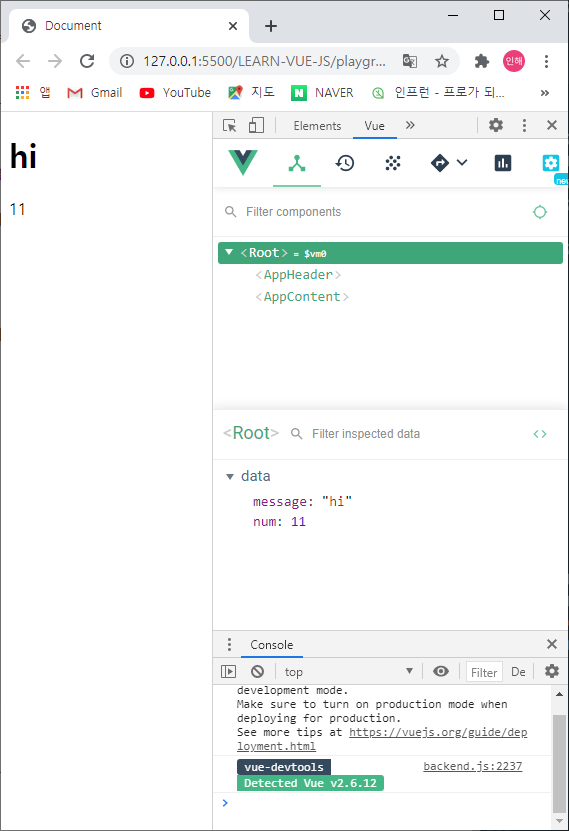
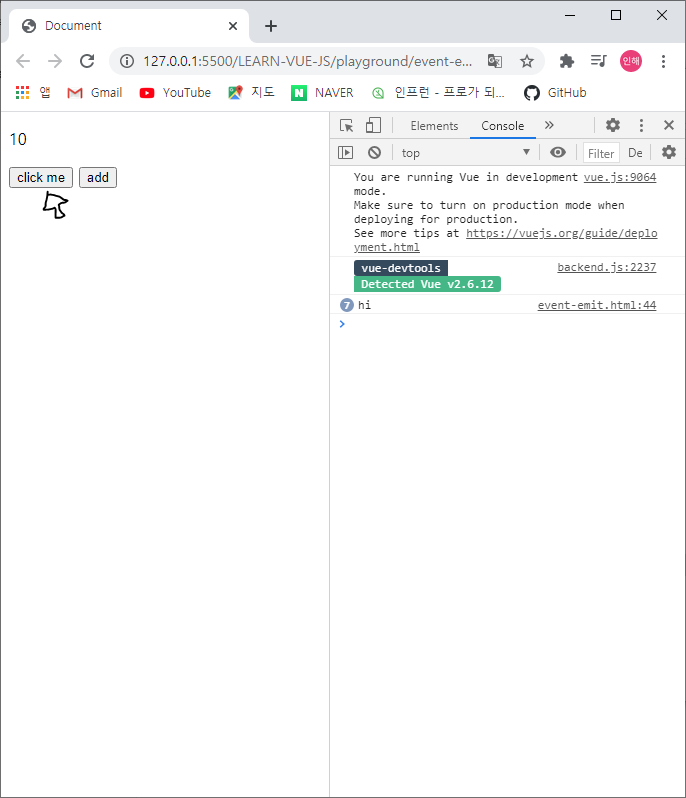
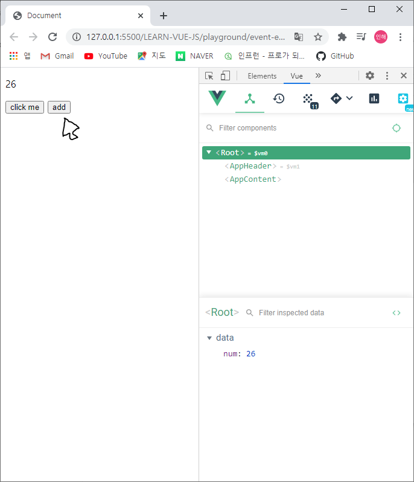
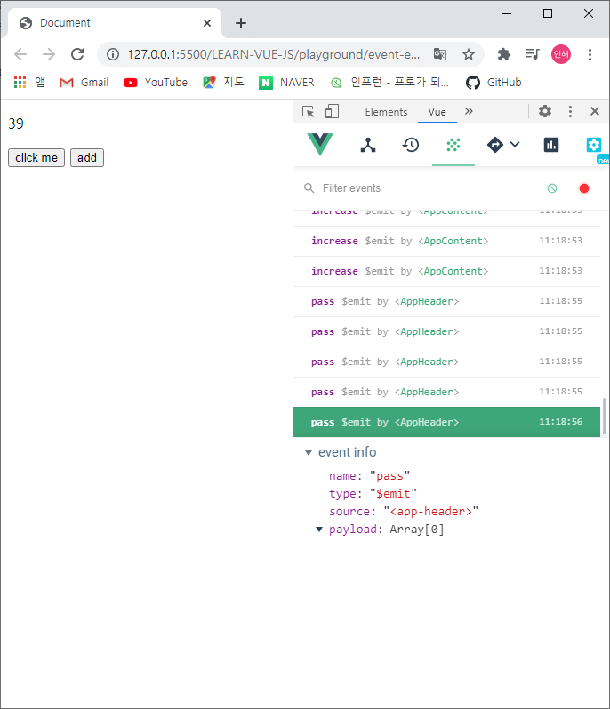

# 컴포넌트 통신 방법 - 기본

+ 컴포넌트 통신 규칙
  + 위 → 아래 : 데이터가 내려감
    + 이 데이터를 Props라고 부름
  + 아래 → 위 : 이벤트가 올라감
  + 데이터의 흐름을 추적할 수 있다는 장점

<br>



<br><br>

### props 속성

```javascript
<app-header v-bind:프롭스 속성 이름 = "상위 컴포넌트의 데이터 이름"></app-header>
```

<br>

-----

<br>

#### props 속성 실습

```javascript
<div id="app">
    <app-header v-bind:propsdata = "message"></app-header>	
    <app-content v-bind:propsdata = "num"></app-content>
</div>

<script src="https://cdn.jsdelivr.net/npm/vue/dist/vue.js"></script>
<script>
    var appHeader = {
      template: '<h1>{{ propsdata }}</h1>',	// {{ propsdata }}아래의 propsdata의 속성/값이 무엇이 되든 간에 반영되도록 함
      props: ['propsdata']	//아래에서 받을 프롭스 이름 정의
    }

    var appContent = {
      template: '<div>{{ propsdata }}</div>',
      props: ['propsdata']	//데이터는 고유의 유효범위를 가지기 때문에, 동일하게 써도 무관 / 위의 propsdata와 구분됨
    }

    new Vue({
      el: '#app',
      components: { //컴포넌트 등록
        'app-header': appHeader,
        'app-content': appContent
      },
      data: {
        message: 'hi',
        num: 10
      }
})
  </script>
```

<br>
<br>

+ 루트 컴포넌트에서 props 속성이 바뀌었을 때, 하위 컴포넌트(AppHeader, AppContent)에도 똑같이 적용됨




<br><br>

-----

<br>

### event emit

```javascript
<app-header v-on:하위 컴포넌트에서 발생한 이벤트 이름 = "상위컴포넌트의 메서드 이름"></app-header>
```

<br><br>

-----

<br>

#### event emit 속성실습

```javascript
<div id="app">
    <p>{{ num }}</p> 
    <app-header v-on:pass="logText"></app-header>
    <app-content v-on:increase="increaseNumber"></app-content>
</div>

    <script src="https://cdn.jsdelivr.net/npm/vue/dist/vue.js"></script>
    <script>
      var appHeader = {
        template: '<button v-on:click="passEvent">click me</button>',
        methods: {
          passEvent: function() { //passEvent를 할 메서드의 이름은 pass Event라는 것
            this.$emit('pass'); //pass는 이벤트이름
          }
        }
      }

      var appContent = {
        template: '<button v-on:click="addNumber">add</button>',
        methods: {
          addNumber: function() {
            this.$emit('increase')
          }
        }
      }

      new Vue({
        el: '#app',
        components: {
          'app-header': appHeader,
          'app-content': appContent
        },
        methods: {
          logText: function() {
            console.log('hi'); //콘솔에 hi출력
          },
          increaseNumber: function() {
            this.num = this.num + 1 //버튼 누를 때마다 1씩 증가
          }
          
        },
        data: {
            num: 10
        }
      })  
    </script>
```


+ $emit : 다른 컴포넌트에게 이벤트를 전달하기 위해 사용


 

<br><br>

※ Vue에서 세 번째 이모티콘이 event를 보여주는 칸으로, event가 일어날 때마다 표시해주어 바로바로 확인할 수 있다.

<br>

+ 결과1
  + AppHeader에 속한 click me 버튼을 누르면 콘솔에서 hi가 입력되는 것을 확인할 수 있음

<br>

+ 결과2
  + AppContent에 속한 add 버튼을 누르면 Root의 데이터, 즉 num이 하나씩 증가하는 것을 확인할 수 있음

<br>

+ 결과3
  + 이벤트가 실행될 때마다, 이벤트 창에서 이벤트가 실행되어짐을 확인할 수 있음

<br><br>

+ this란?
  + object method에서 owner를 가리킨다.
  + 즉, this가 포함된 함수를 가리킨다. 따라서, 함수안에 있는 this 뒤의 개체를 가리키게 된다.
  + this 뒤에 아무것도 붙지않고, 혼자 나올 경우 전역변수를 가리킨다.
  + 위의 예시에서는 num이 data 안에 있지만, 사실 밖으로 나와있는 것이나 다름 없다. 따라서 num을 가리키게 된다.

