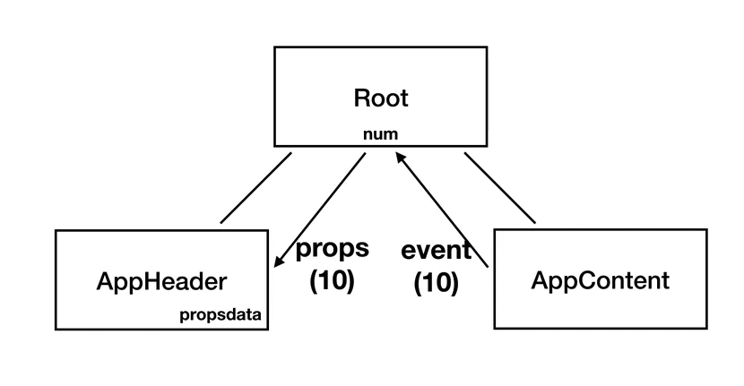
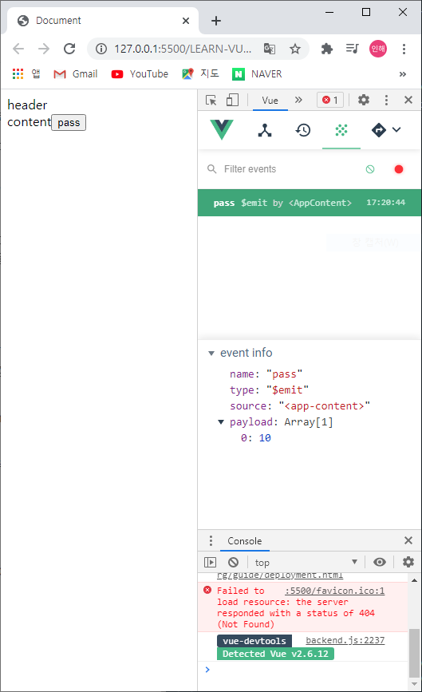
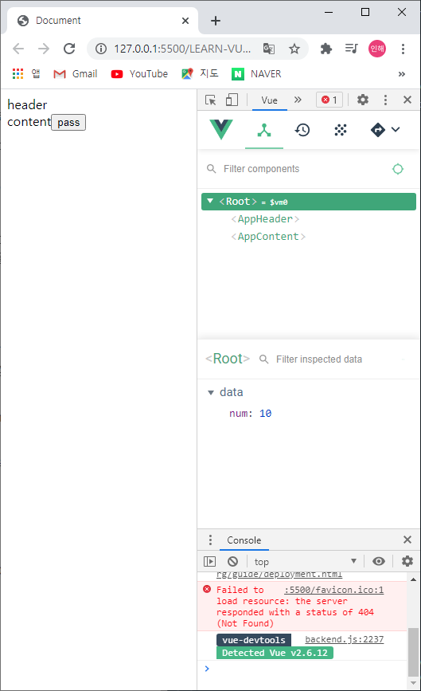
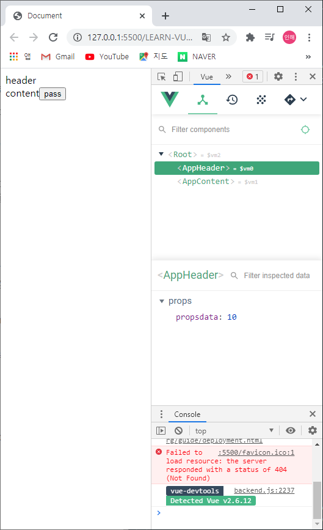

# 컴포넌트 통신방법 - 응용

### 같은 레벨 간의 통신 방법

상위컴포넌트/하위컴포넌트가 아닌 같은 레벨의 컴포넌트와 통신하는 방법이 무엇일까?



AppContent에서 event로 Root에게 10을 주고, 그걸 받아서 Root는 AppHeader로 10을 props 데이터 형식으로 전달한다.

(이때, Root는 상위컴포넌트 / AppHeader와 AppComponent는 하위컴포넌트)


-----


#### 같은 레벨 간의 통신 방법 구현

```javascript
<div id="app">
    <app-header v-bind:propsdata="num"></app-header>
	<app-content v-on:pass="deliverNum"></app-content>
</div>

<script src="https://cdn.jsdelivr.net/npm/vue/dist/vue.js"></script>
    <script>
      var appHeader = {
        template: '<div>header</div>',
        props: ['propsdata']
      }
      var appContent = {
        template: '<div>content<button v-on:click="passNum">pass</button></div>', 
        methods: {
          passNum: function() { //위에서 v-on:click이라는 속성을 추가해서 passNum이라는 method로 전달할 수 있도록함
            this.$emit('pass', 10);
          }
        }
      }

      new Vue({
        el: '#app',
        components: {
          'app-header': appHeader,
          'app-content': appContent
        },
        data: { 
          num: 0
        },
        methods: {
          deliverNum: function(value) { //passNum을 통해 넘어온 value(10)을 상위컴포넌트인 Root 컴포넌트에 전달됨
            this.num = value;
          }
        }
      })
    </script>
```


1. appContent 컴포넌트에서 10을 넘겨주는 이벤트 발생시키기

+ appContent 컴포넌트 선언 시, 템플릿에 content라는 글자와 pass 버튼을 함께 넣어줌

+ 버튼에 **\<button v-on:click="passNum">**이라는 속성을 추가하여 passNum이라는 method 속성을 사용

+ passNum : **_$emit_**을 이용하여, **_'pass'_**라는 이벤트를 통해 10을 넘겨줌 → 이벤트 탭에서 payload에 10이 찍히는 것을 확인할 수 있음 

  

2. Root 상위 컴포넌트로 10을 넘겨줌

+ Vue 안에 methods 속성으로 deliverNum이라는 함수 선언

+ **_passNum_**을 통해 넘어온 value인 10을 Root컴포넌트로 전달 (하위컴포넌트 → 상위컴포넌트)

  + 이때, **_this.num_**을 사용하여 data안의 **_num_**에 접근

+ app-content 등록시, **_\<app-content v-on:pass="deliverNum">_**이라는 속성을 추가하여 **_deliverNum_**이라는 method를 사용

  

3. appHeader 컴포넌트가 10을 넘겨받음

+ 컴포넌트 속성으로 props에 propsdata라는 이름으로 선언
+ app-header 등록시, **_\<app-header v-bind:propsdata="num">_**이라는 속성을 추가하여 props를 전달받음




+ 결과1
  + pass를 눌렀을 때, app-content라고 하는 하위컴포넌트에서 이벤트가 잘 발생하는 지 확인
+ 결과2
  + pass를 눌렀을 때, Root 상위컴포넌트의 num이라는 data 속성이 잘 바뀌었는 지 확인
+ 결과3
  + pass를 눌렀을 때, app-header라고 하는 하위컴포넌트에서 props 속성인 propsdata로 data가 잘 받아지는 지 확인