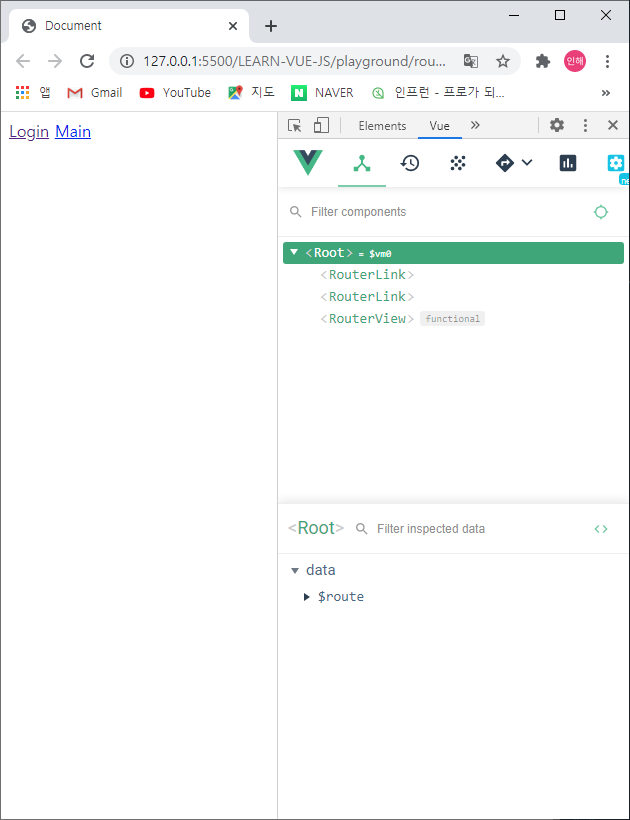
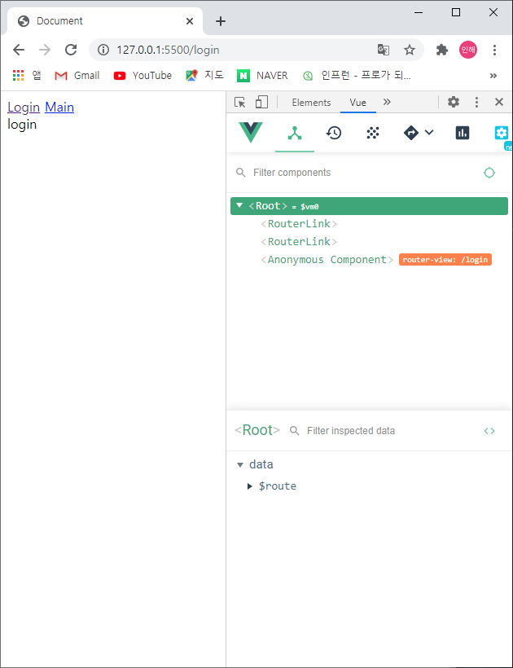

# 라우터

뷰 라우터는 뷰 라이브러리를 이용하여 싱글 페이지 애플리케이션을 구현할 때 사용하는 라이브러리입니다. 즉, 페이지 이동과 관련된 기능을 구현할 수 있다.

<br><br>

+ **_script:src_**를 누르면 바로 **_\<script src ="">\</script>_** 가 만들어진다.

+ 반드시 Vue라이브러리를 먼저 넣고 그 후에 뷰 라우터 라이브러리를 넣을 것

```javascript
<script src="https://cdn.jsdelivr.net/npm/vue/dist/vue.js"></script>
  <script src="https://unpkg.com/vue-router/dist/vue-router.js"></script>
```

<br><br>

-----

<br>

```javascript
<div id="app">
    <div>
      <router-link to="/login">Login</router-link>
      <router-link to="/main">Main</router-link>
    </div>
    <router-view></router-view>
</div>

<script src="https://cdn.jsdelivr.net/npm/vue/dist/vue.js"></script>
<script src="https://unpkg.com/vue-router/dist/vue-router.js"></script>
<script>
    var LoginComponent = {
        template: '<div>login</div>'
    }
    var MainComponent = {
        template: '<div>main</div>'
    }

    //라우터 인스턴스 생성
    var router = new VueRouter({
        mode: 'history',
        // 페이지의 라우팅 정보
        routes: [
            //로그인페이지 정보  
            {
                //페이지의 url 이름 속성을 키 값 형태로 저장
                path: '/login',
                name: 'login',
                // 해당 url에서 표시될 컴포넌트
                component: LoginComponent
            },
            //메인페이지 정보
            {
                path: '/main',
                name: 'main',
                component: MainComponent
            }
        ]
    });

    //인스턴스에 라우터 인스턴스를 등록
    new Vue({
        el: '#app',
        router: router//Vue에 router라는 재사용 속성이 있음
    })
</script>
```

<br>

+ mode
  + url끝에 해쉬(#)를 없애주는 역할
  + ex) ../router.html#/login → ../router.html/login (깔끔)

<br>

+ routes
  + **페이지의 라우팅 정보**(어떤 url로 들어갔을 때, 어떤 페이지가 나올지)가 배열로 담김, **페이지의 갯수만큼 객체{}가 필요**
  + path 
    + 페이지의 url 이름 속성을 키 값 형태로 저장
  + component
    + 해당 url에서 표시될 컴포넌트

<br>

+ router: router
  + **vue router를 Vue에 연결했을 때 사용할 수 있는 형태로 만들어줌(= 라우터 연결)**
  + 앞의 router는 Vue에 정의된 **재사용 속성**
  + 뒤의 router는 위에서 정의한 **router 변수**
  + 이로 인해, Root에 **_$route_**가 생김
  + 이것을 적어주지 않으면, router가 작동하지 않음

<br>

+ router link
  + router-link*2라고 치면, **_\<router-link>\</router-link>_** 가 두 개 나온다.
  + a + Enter키 치면, **_\<a href="">\</a>_** 가 나온다.
  + **_\<router-link to="/login"> Login\</router-link>_** 는 **_\<a href="/login">\</a>_** 와 같은 의미
  + router-link 안에 to="이동할 URL"을 넣어 이동할 수 있도록 해줌

<br>

+ component
  + routes안의 각 페이지마다 component는 하나밖에 없음 → components 가 아니라 **component**

<br><br>

-----

<br>



<br>

+ url 끝에 '/login' 을 넣어주면 login 페이지로, '/main' 을 넣어주면 main 페이지로 가는 것을 확인할 수 있다.
+ 그러나 이때, 사용자는 login, main 페이지로 어떻게 가는 지 모르기 때문에 링크를 걸어주어야 한다.

+ Root 데이터에 $route가 들어있는 것을 볼 수 있다.