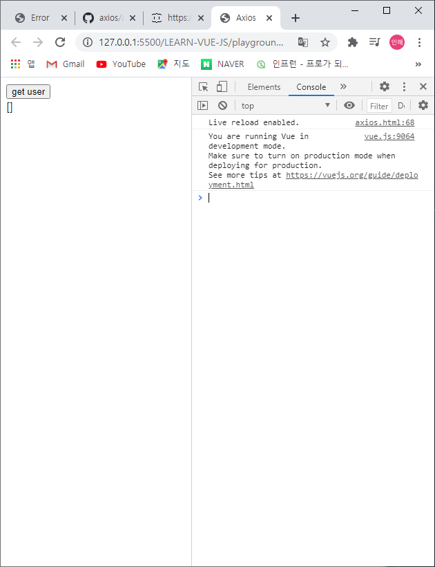
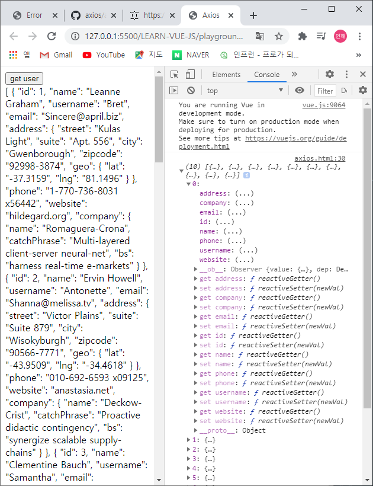
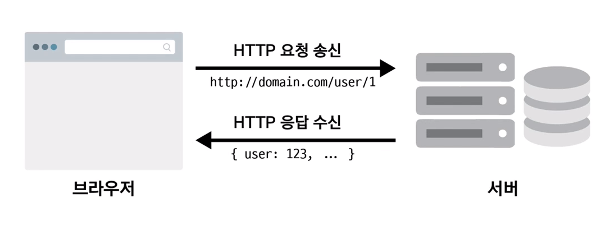
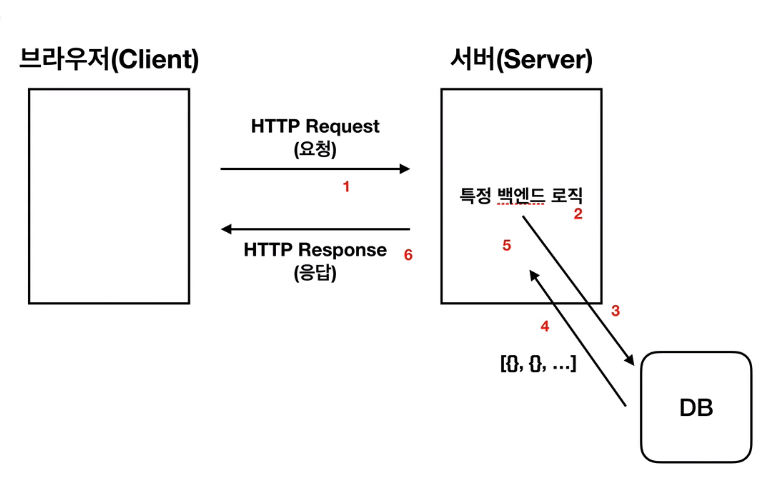
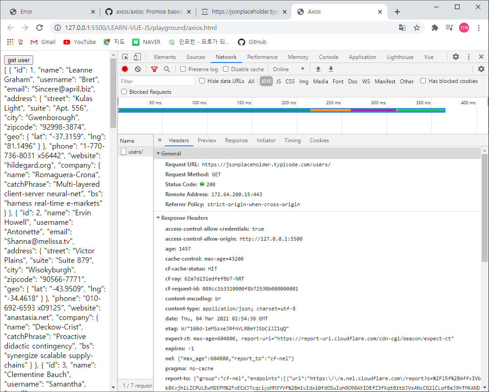

# HTTP 통신 라이브러리 - axios

<br>

## 액시오스(Axios)

뷰에서 권고하는 HTTP 통신 라이브러리입니다.

Promise 기반의 HTTP 통신 라이브러리이며, 상대적으로 다른 HTTP 통신 라이브러리들에 비해 문서화가 잘 되어 있고 API가 다양합니다.

+ [github 주소](https://github.com/axios/axios) 
+ github를 볼 때, star 수/commit 수/contributors 수/commit 이력(고친 날짜)를 참고하면 좋음

<br><br>

+ Ajax
  + 비동기적인 웹 애플리케이션의 제작을 위한 웹 개발 기법
  + 모든 코드가 아닌 필요한 데이터만 서버에서 따로 받아와서 수정할 수 있음
  + 뷰 라우터나 싱글페이지 어플리케이션에 용이
  + jQuery에서 사용

<br>

+ vue-resource
  + 예전 공식 라이브러리
  + 실제로 구현할 때, vue-resource로 된 것이 많은데 오래 되었을 것이니까 인지할 것

<br>

+ 자바스크립트의 비동기 처리 패턴
  1. callback
  2. promise
  3. promise + generator
  4. async & await

<br><br>

-----

<br>

```vue
<div id="app">
    <button v-on:click="getData">get user</button>
    <div>
      {{ users }}
    </div>
</div>

<script src="https://cdn.jsdelivr.net/npm/vue/dist/vue.js"></script>
<script src="https://unpkg.com/axios/dist/axios.min.js"></script>
<script>
    new Vue({
    el: '#app',
    data: {
        users: []
    },
    methods: {
        getData: function() {   //데이터 호출
            var vm = this; // 1. this
            axios.get('https://jsonplaceholder.typicode.com/users/')  //10개의 유저정보를 받아오는 것
                .then(function(response) {  //성공시 진입
                console.log(response.data);
                vm.users = response.data; // 2. this.user 로 해도 무관 / 그러나 this가 서로 다른 것을 가리키는 것을 알아야함
            })
                .catch(function(error) {  // 실패시 진입
                console.log(error);
            });
        }
    }
})
  </script>
```

<br>



<br><br>

+ getdata를 가지고 데이터를 호출
+ https://jsonplaceholder.typicode.com/users/ 에는 10개의 유저정보가 담겨있음

+ then / catch 를 이해하기 위해서는 promise를 알아야함
  + then : 성공 시 진입
  + catch : 실패 시 진입
+ **_console.log(response.data)_** 데이터 저장
+ **_{{ users }}_** 로 화면에서 모두 볼 수 있도록 함
+ **_var vm = this_** / **_vm. users = response.data_**
  + this / this.users = rsponse.data 로 바꿔도 무관하다.
  + 그러나 이 때, 서로 다른 this라는 것을 인지해야한다.

<br>

<br>

-----

<br>

## 웹 서비스에서 HTTP 통신구조

<br>



<br>

+ HTTP
  + 클라이언트(브라우저)와 서버 간의 데이터를 주고 받기 위한 규칙

<br><br>



<br>

1. 브라우저가 서버에게 HTTP request(요청)한다.
2. 서버에서 특정 백엔드 로직이 실행된다.
3. DB에 그 로직에 의해 데이터를 달라는 코드를 실행한다.
4. DB에서 서버로 데이터를 전송한다.
5. 특정 백엔드 로직이 실행된다.
6. 서버에서 브라우저에게 HTTP response(응답)한다.

<br>

-----

<br>



<br>

get user 버튼을 눌렀을 때, **Network 패널**에 나오는 결과

프론트엔드 개발자가 되면 가장 많이 보는 화면일 것

1. Header

   HTTP의 헤더 / 일반적인 부가 정보(요청에 대한 정보나 응답)

   1. General

      + Request URL로 get 요청을 보냈다.

      + Status Code 초록불은 성공을 의미 (200은 보통 성공)

   2. Response Headers

      + 서버에서 어떻게 정보를 보냈는 지에 대한 정보

   3. Request Headers

      + 이 브라우저에 대한 정보
      + 이 브라우저가 받아들일 수 있는 정보
      + 등등 부가정보

<br>

2. Response
   1. get 요청을 보냈으므로, 받아진 데이터가 보이는 곳
   2. 그러나 이를 Preview창에서 보는 것이 더 편함

<br><br>

※ [프런트엔드 개발자가 알아야하는 HTTP 프로토콜 Part1](https://joshua1988.github.io/web-development/http-part1/ )

<br>

※ [구글 크롬 개발자 도구 공식 문서](https://developers.google.com/web/tools/chrome-devtools/)


