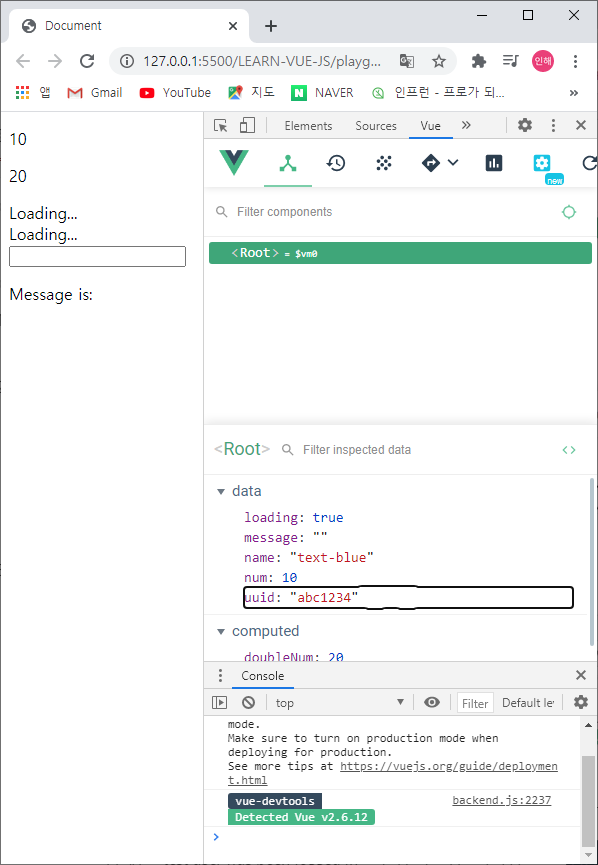
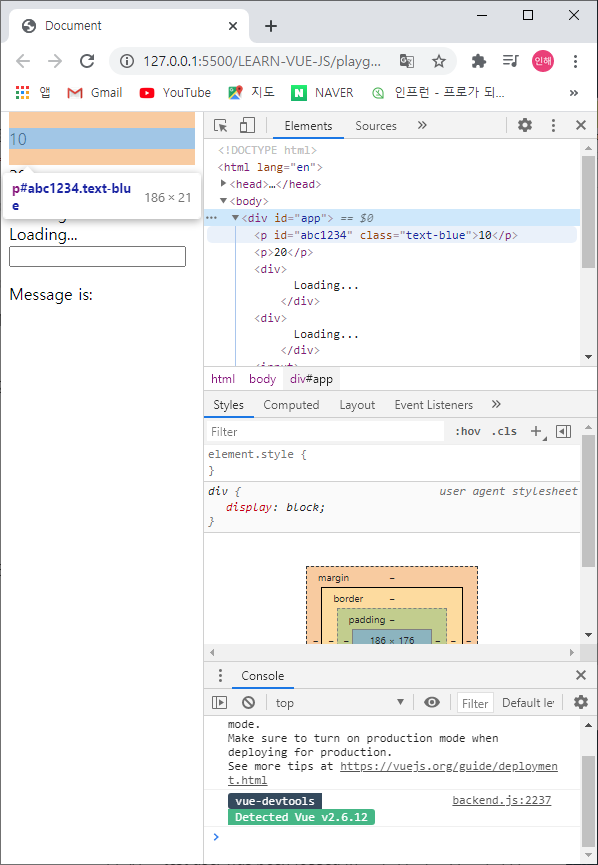
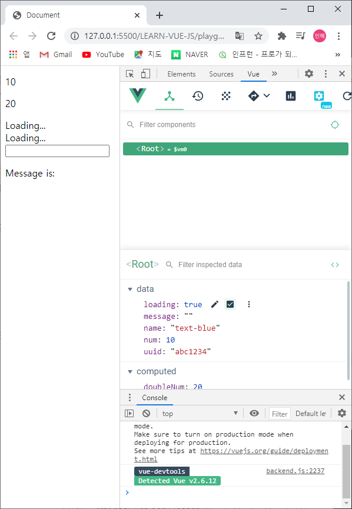
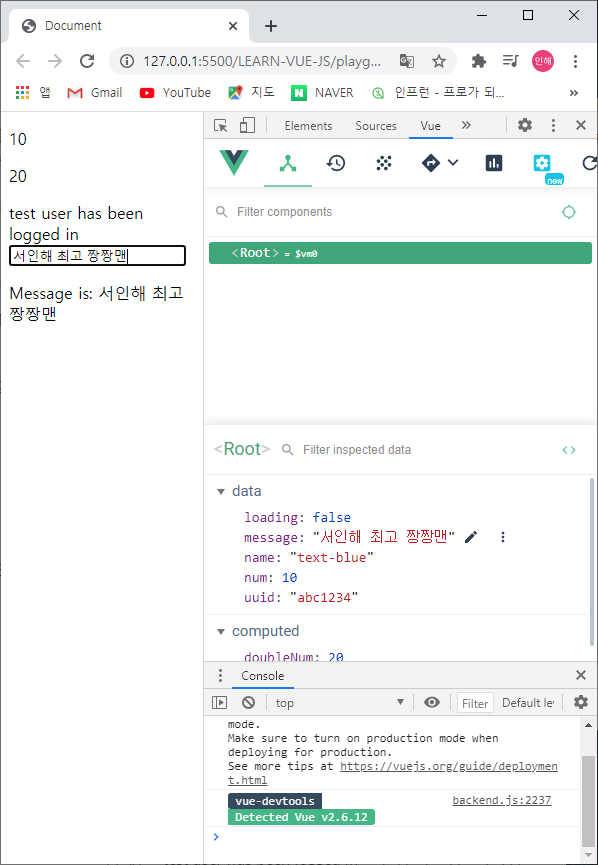
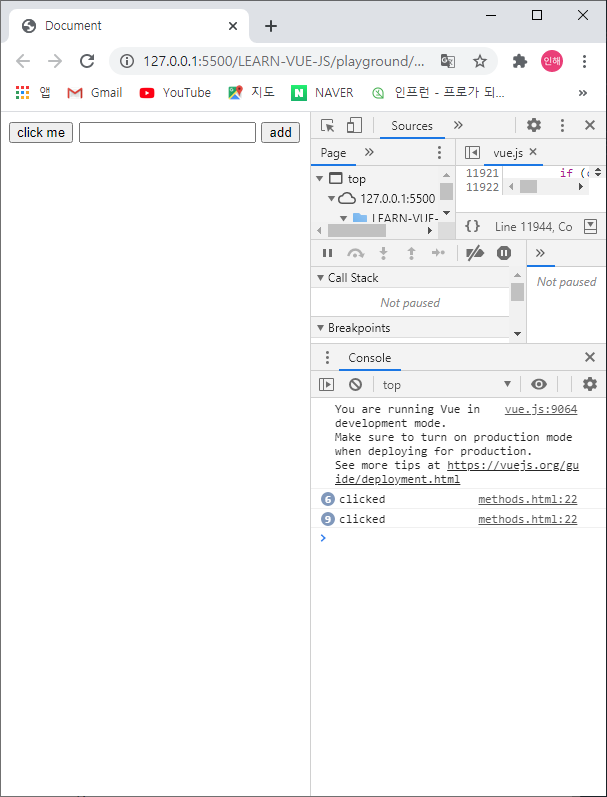

# 템플릿 문법 - 기본

<br>

## 뷰의 템플릿 문법

뷰로 화면을 조작하는 방법을 의미합니다. 템플릿 문법은 크게 데이터 바인딩과 디렉티브로 나뉩니다.

<br>

### 데이터 바인딩

뷰 인스턴스에서 정의한 속성들을 화면에 표시하는 방법

가장 기본적인 방법은 콧수염 괄호(Mustache Tag)이다.

+ message를 화면에 연결할 때, 사용하는 방법

```javascript
<div>{{ message }}</div>
```

```javascript
new Vue({
    data: {
        message: 'Hello Vue.js'
    }
})
```

<br>

-----

<br>

### 디렉티브

뷰로 화면의 요소들을 더 쉽게 조작하기 위한 문법

화면 조작에서 자주 사용되는 방식들을 모아 디렉티브 형태로 제공

+ HTML 태그에서 일반적으로 id나 class 등 기본속성을 제외하고, **_v-_** 라고 붙는 속성들

```javascript
<div>
	Hello <span v-if="show">Vue.js</span>
</div>
```

```javascript
new Vue({
    data: {
        show: false
    }
})
```

<br><br>

-----

<br>

### 클래스 바인딩 / 그 외

```javascript
<div id="app">
    <p v-bind:id="uuid" v-bind:class= "name">{{ num }}</p>
<!--<p id="abc1234">{{ num }}</p>와 같음-->
<p>{{ doubleNum }}</p>
<div v-if="loading">
    Loading...
        </div>
<div v-else>
    test user has been logged in
        </div>
<div v-show="loading">
    Loading...
        </div>
<!--인풋 박스를 만들고 입력된 값을 p태그에 출력해보세요-->
    <input v-model="message">
        <p>Message is: {{ message }}</p>
</div>

<script src="https://cdn.jsdelivr.net/npm/vue/dist/vue.js"></script>
<script>
    new Vue ({
    el: '#app',
    data: {
        num: 10,
        uuid: 'abc1234',
        name: 'text-blue',
        loading: true,
        message: "" 
    },
    computed: {
        doubleNum: function() {
            return this.num * 2;
        }
    }
})
</script>
```

<br>



<br>

1. **computed** 속성 - 데이터에 따라서 바뀌는 값을 정의하는 경우

   <br>

2. **_v-_** 라는 속성이 들어가게 되면, data, computed 등의 속성을 주어야한다.

   1. **_v-bind:id="uuid"_** 가 웹에서는 **_id="abc1234"_** 로 바뀌어서 들어가게 된다.
   2. 마찬가지로, **_v-bind:class="name"_** 가 웹에서는 **_class="text-blue"_** 로 바뀌어서 들어가게 된다.

   <br>

3. **_v-if_** 와 **_v-else_** / **_v-show_**

   1. C언어에서의 if-else 구문과 같은 것
   2. **_v-if_** 와 **_v-show_** 뒤에는 : data 속성이나 computed, method등의 속성이 들어가는데, **_v-else_** 뒤에는 아무것도 들어가지 않는다.
   3. 웹에서 요소 검사해보기
      1. loading이 true일 때
         + **_v-if_** 에서도 Loading... 글자가 나타남
         + **_v-show_** 에서도 Loading... 글자가 나타남
      2. loading이 false일 때
         + 웹에는 *' test user has been logged in '* 이라는 글자만 나타남
         + 요소 창에서 **_v-if_** 는 div가 완전히 제거됨
         + 그러나 **_v-show_** 는 css style에서 **_"display: none;"_** 으로 나타남 / 유관상으로만 보이지 않게 하고 정보는 남아있음

4. input 박스

   + input 박스에 적은 message를 아래에 똑같이 출력하도록 제작

<br>

[Vue.js 공식 홈페이지](https://vuejs.org/) 에서 Learn ▼ 메뉴의 Guide, API 많이 볼 것

<br><br>

-----

<br>

```javascript
<div id="app">
    <button v-on:click="logText">click me</button>
    <input type="text" v-on:keyup.enter="logText">
    <button>add</button>
</div>

<script src="https://cdn.jsdelivr.net/npm/vue/dist/vue.js"></script>
<script>
    new Vue ({
    el: '#app',
    methods: {
        logText: function() {
            console.log('clicked');
        }
    }
})
</script>
```

<br>




1. **_v-on:click="메서드 이름"_** 을 추가해 주면, 버튼을 클릭(~~마우스 입력~~)했을 때 메서드가 실행된다.

   + 아래에 methods 칸에 추가해 줄 것

   + 누를 때마다 콘솔에서 확인할 수 있음

     <br>

2. **_v-on:keyon="메서드 이름"_** 혹은 **_v-on:keypress="메서드 이름"_** 을 추가해주면, 키보드를 쳤을 때(~~키보드입력~~) 메서드가 실행된다.

   + 이때, **_v-on:keyon.enter="메서드 이름"_** 에서 **_._** 이라는 *'Event Modifiers'* 라고 하고, enter를 입력했을 때만 메서드가 실행되도록 한다.

